_Originally posted on:_ [_https://viktorfonic.com/2016-year-review/_](https://viktorfonic.com/2016-year-review/)

2016, huh? It was the most life-changing year of my life…again! Let’s review.

_Slovenia, Croatia, Finland, Estonia, Latvia, Sweden, Brazil, Italy, Ireland, Amsterdam, Romania, Hungary, Bosnia, Serbia, Macedonia, Greece, Austria, Poland, Spain, Portugal, Thailand. (I didn’t write duplicates and I skipped countries where I didn’t stay more than one day.)_

### Life-changing Avalanche

My huge life-changing snowball actually formed and started rolling in mid 2015 when I said “that’s it”, flipped the table and quit my job at Microsoft (I’ll write a dedicated blog post about this). Working for Microsoft was a great experience and Dublin as a city is an extreme melting pot of all the world’s cultures. To all the great people that I met in Dublin: I miss you. ❤️

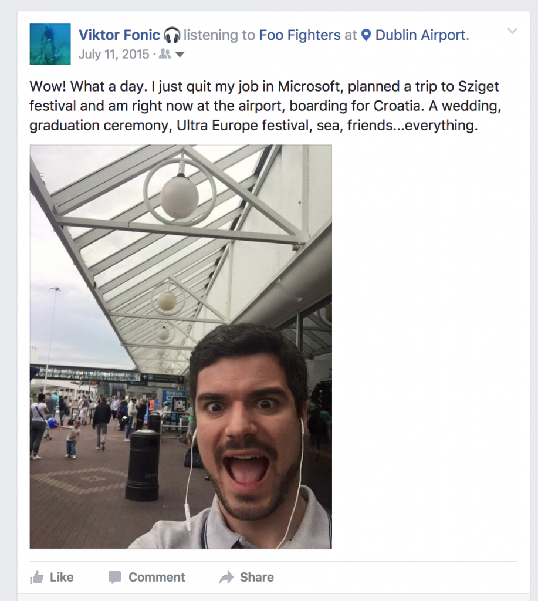

### Celebrating New Year’s Eve

I celebrated New Year’s Eve with my friends from Slovenia. These are some of the craziest and funniest people I know.

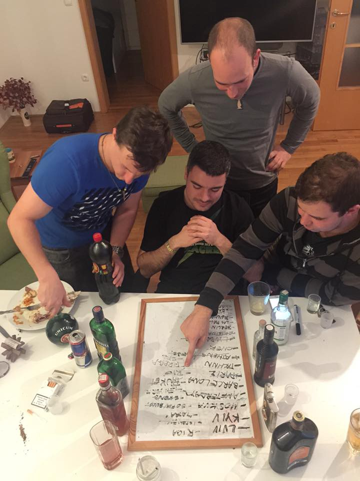

### 127.0.0.1 a.k.a. Home

At the time I was remote working for a small software company from London called [DVELP](https://dvelp.co.uk/). It was a good gig. :) I went to Zagreb, Croatia, my second Home and visited some friends.

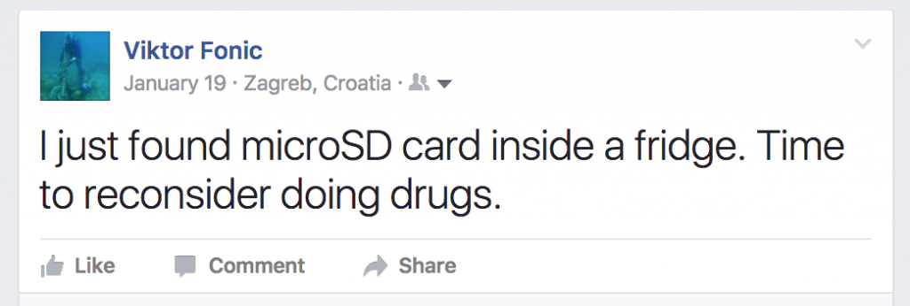

### Baltic Cruise

After Croatia, I did a little cruise around Baltic countries. What a trip… 8€ beers, ice breakers (literally), losing a phone, finding a phone, justifying ending up in a cruise ship prison with: “Hey, it was on the TODO list!”.

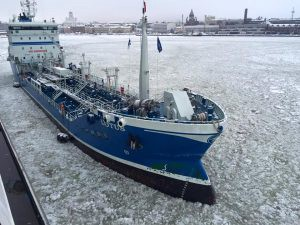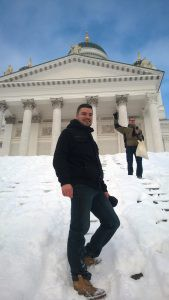

### Breaking Stereotypes

From Scandinavia, winter, absolute zero temperatures, I flew straight to tropical paradise: Brazil. But allow me first to tell you how I got there. It all started with a drama.  
 Me: “Thomas, can you please swipe right on this screen here?”  
 Thomas: “What is this? Ticket to Rio de Janeiro? No, you’re kidding me! I can’t ‘swipe’ this for you.”  
 Me: “OK, let me swipe that real quick.”  
 — **120 seconds of extremely slow swiping later** —   
 Thomas: “Ummmm that was a fake demo payment right?!?!?!”  
 Me: “Nope.”  
 Thomas: “You didn’t do it. That was a video, right?”  
 Me: “Nope.”

Yeah, I did it. I just bought my first cross-continental trip, if you don’t count my venture from west Istanbul, Europe to east Istanbul, which is in Asia.

The trip to Brazil was one of the most life-changing experiences for me. Everyone warned me to be careful, since there’s a lot of crime in Brazil. When I landed in Rio de Janeiro, I was so scared to walk outside of the airport. I ordered Uber and arrived to an Airbnb rented apartment, safely and in one piece and with all of my belongings. When I arrived, I dropped my bag with my laptop, took my old phone and some cash and felt finally safe to walk around the city. If someone attacks me, I hoped I had enough money to “pay for my life”. Luckily nothing bad happened and I spend incredible month traveling around Brazil and changing the stereotypes in my head about that country. It is a dangerous country, but I fell in love with it so much that I’m willing to risk everything and live there in the future.

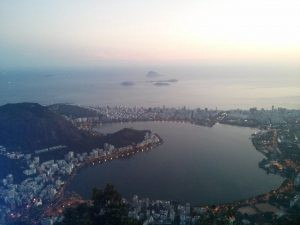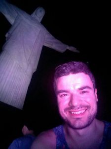

### Rio de Janeiro Carnival

I went to Brazil at the best time of the year: February — The Carnival.  
 On samba parade each year there are 6 schools parading and competing for the best. They prepare their costumes and props for the entire year. Each school has 1 hour to parade on Sambodromo and show the choreography.  
 There are several categories that determine the winner:  
 Percussion Band, Samba Song, Harmony, Flow and Spirit, Theme of the Year, Overall Impression, Floats and Props, Costumes, Vanguard Group, The Flag Carrying Couple.  
 After every samba school, an army of cleaners comes on the track and cleans it in 15min.  
 The whole show is really impressive. It’s unbelievable synchronization of moves and all the effort made to prepare everything…incredible

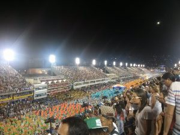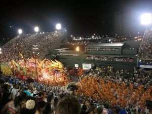

### A Fresh Start…Again?!

When I got back to Europe from Brazil, I decided to quit my job (again). As I mentioned earlier, I was working remotely for London-based company called DVELP. Although I think it was a great company with incredible people and work conditions (remote work, flexible work hours, good salary, etc.), I decided it’s time to take one step further — starting my own company. A lot of my friends called me crazy. They said my job was almost ideal to quit and “there are many people working in worse conditions”. I have this thing that I **never** compare myself (or anything else) with _worse_. I always compare with better. If you’re reading this, you’re probably richer than 99% of the world’s population. So, comparing with worse than yourself, should make you happy about any shitty job you might have right now. Don’t settle, if you can get better.

Oh, I also learned how to make the best lasagne in the world.

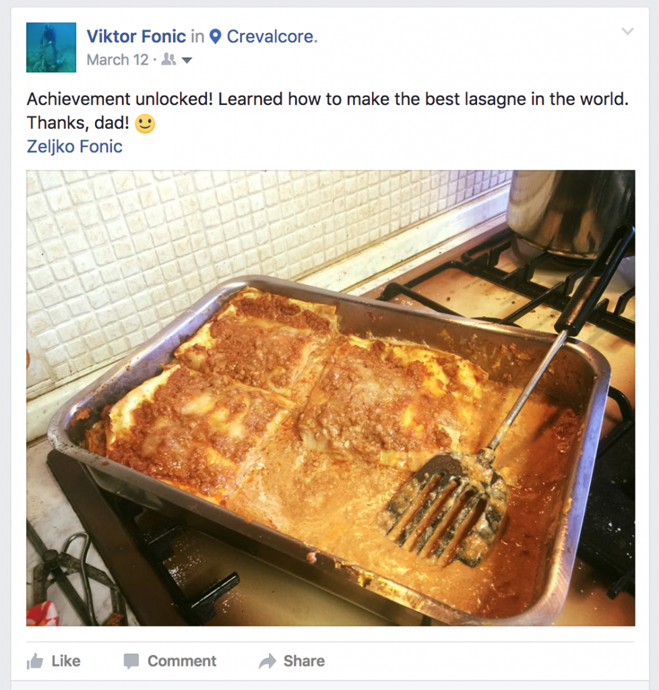

Somewhere around this time I asked myself why do I need to pick a city, rent an apartment, live there for months and months. Instead I decided to constantly travel. To be a digital nomad. If I get bored or tired, I’ll stop, but since 1st November 2015, it’s been going quite well. I haven’t spent more than a month in a single city.

### The Eurotrip

Where to start? I think this one starts at St. Patrick’s Day in Dublin and King’s Day in Amsterdam. I made sure to experience both. :) The trip continues to Tallinn, Estonia where I met my friends from [BEST](https://best.eu.org/) student association during BEST General Assembly.

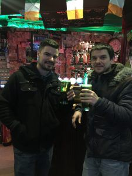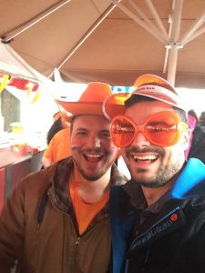

From Tallinn I decided to continue my trip by hitchhiking. I found a relatively good location at the exit of the city and raised my thumb. It was so strange and scary. Relying on complete strangers, to drive me across Europe. I was also constantly obsessed by what people looking at me think of me right now. It was weird and a bit embarrassing. I’m glad I did it and met all the people that I would’ve never had the chance to meet otherwise.

I’ve hitchhiked most of my trip from Tallinn, Estonia, through Cluj-Napoca, Romania, to Novi Sad, Serbia. It was an incredible experience. Listening to drivers’ crazy stories about doing jail-time, crazy partying, Christianity and gipsy life, drinking coke-beer-vodka cocktails in Romanian mountains with friends, bumping into BEST-ies while walking around all alone in the streets of Timisoara, meeting Serbian village workers so happy to meet someone from Croatia, even though there was a war between Serbia and Croatia less than 20 years ago. One of them said: “You didn’t make my day, you made my whole month!” Just these little things made the whole trip worth doing.

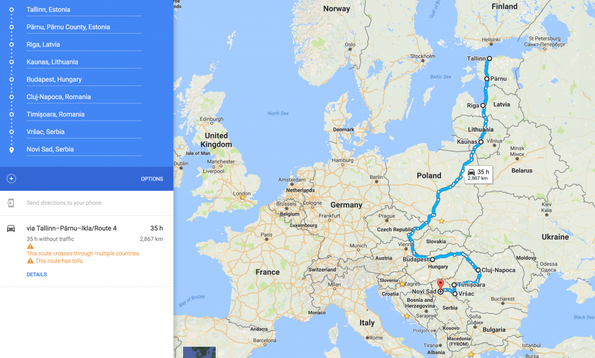

### Home Again and South Europe

I passed through Zagreb and Split real quick and continued my trip, going through south Bosnia and Herzegovina, Serbia, Macedonia and finally arriving to Greece for a two week sunbathing and chilling pit-stop. While in Bosnia, I visited the city of Sarajevo for a day and it left a great impression on me. It’s a city that survived 44 months long siege during the Yugoslavian war in the 90's! I believe Franco Ortega, a guy who I met in Sarajevo, said it best in his facebook status:

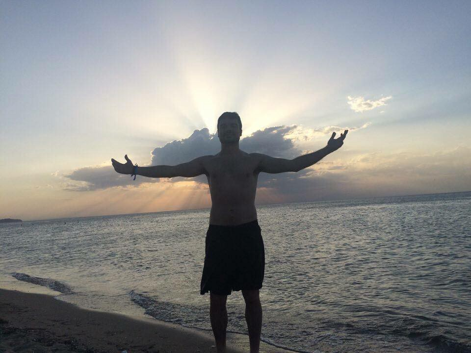

### Polish Wedding

From Greece, I went to Poland to a friend’s wedding. What an experience that was! Did I forget to say the wedding was in Poland? The land of the best vodka on the planet? I forgot, because maybe I blacked out there for a second…

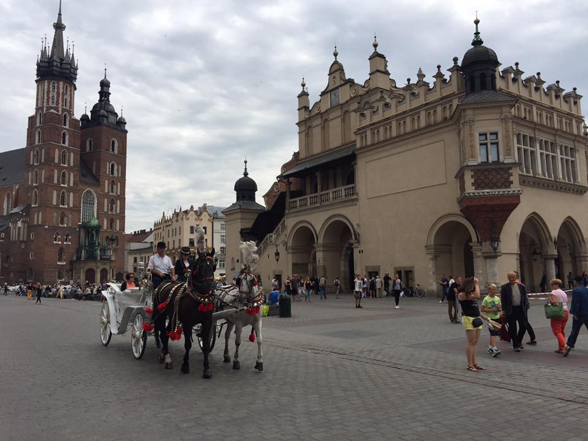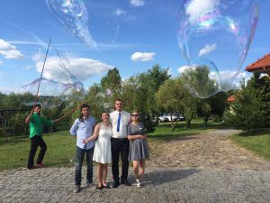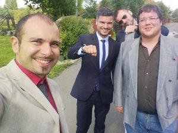

### Electric Castle, Romania

After Poland, my trip continued to Romania, where I went to Electric Castle festival. Since it’s Romania, Eastern Europe, and I spent last two years living in expensive Dublin, my friends and I decided we’ll buy the most expensive VIP camping with pre-pitched tents. What a great idea that was. :) A tent, inside of which you can stand, with two double inflatable mattresses. Even the grass was greener on our camping area. Would do again.  
 On third day of the festival, during Skrillex’s performance, a huge rain started falling. It’s hard to call that just a rain. It was raining cats and dogs for several hours. The amount of rain that fell there in 2 hours was more than an average amount of rain that usually falls there during the entire month. Everything was muddy and everyone was wet to the bones. It’s something I’m glad I experienced, but would not like to repeat again. It’s one of those once-in-a-lifetime experiences.

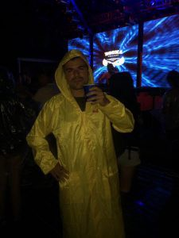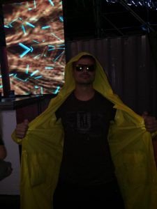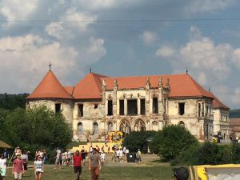Electric Castle 360](./asset-23.gif)

### The ‘famous’ Pigeon of Barcelona

I continued my trip from Cluj-Napoca, Romania, to Barcelona. It was on the way, I swear!  
 Summer in Spain means just one thing: fiesta (or festa in Catalán), and a lot of it. You’d need to spend two lifetimes in Spain to see all the different fiestas they have.

Everything was fine and then The Pigeon happened.  
 Those couple of days I was staying at my friend’s apartment in Barcelona. He didn’t go out with me that night because he wanted to get enough sleep for tomorrow’s work. I went out with some other friends and came back pretty late. I woke up in the morning to the sound of a new notification. It was a message from him.  
 Jordi: “Mate, why was there a dead pigeon in the terrace?”  
 Me: “Whaaaat? Dead pigeon? I don’t remember catching any pokemon on your terrace.”  
 Jordi: “When I woke up a seagull was eating the pigeon”  
 (…)  
 Me: “This is too much for me. Wtf happened last night? I remember everything until the moment after entering the apartment.”  
 Jordi: “Imagine me waking up to a phone call from work, hearing the house door slam, seeing light in the big bathroom and a seagull eating a pigeon in the terrace. Then I knock on the toilet door and turns out you are sleeping there”  
 Me: “So I passed out in the toilet?!?!”  
 Jordi: “Yup”  
 Me: “This is the worst day of my life and I just woke up.”

I was so hangovered and confused as to what happened. All I can say is:  
 \* Some things are still left unclear  
 \* Some things are better left unclear  
 \* Some animals were harmed during the occurrence of this story  
 \* Some _minor_ details were left out of the story to protect involved characters’ dignity

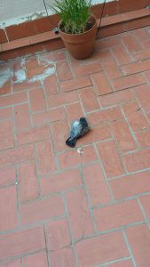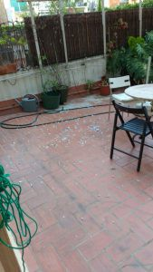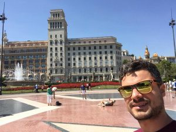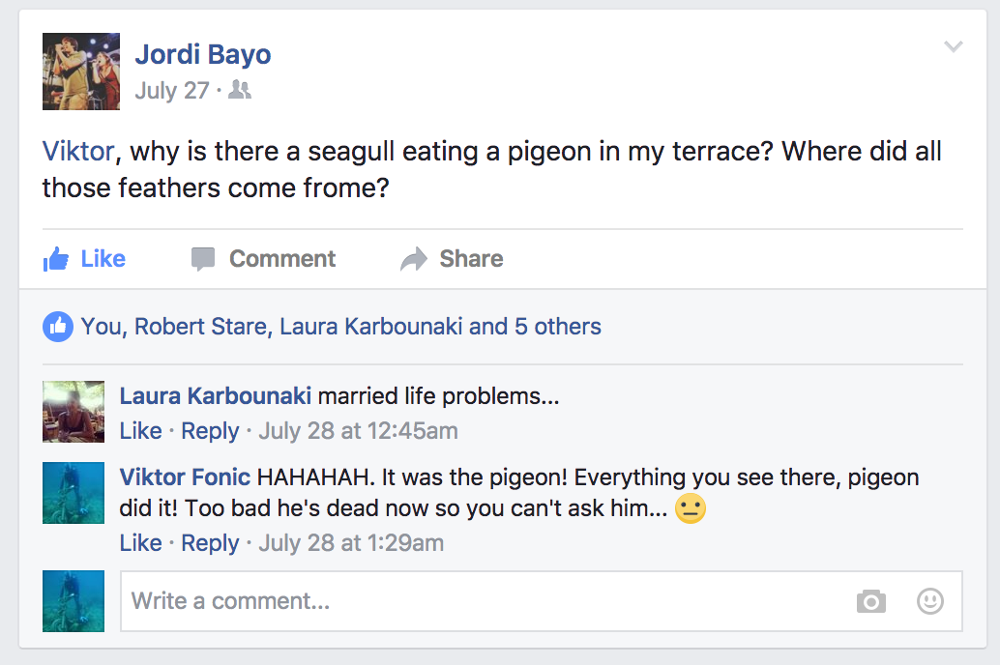

### Surfing the Ocean Waves

Next stop from Barcelona was Portugal, mainly Praia de Mira, Coimbra and Porto. In Porto I went surfing for the first time in my life. Surfing for the first time is such an unrewarding experience. I barely managed to stay on the surfboard for couple of seconds, twice, in three hours of surfing. But it’s such a rewarding experience when you finally succeed.

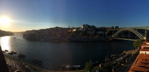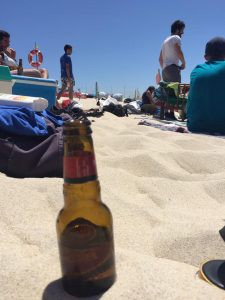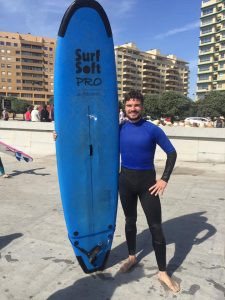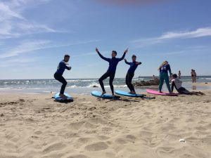

### Tapas or How to Get The Free Dinner While Drinking Beer

The Eurotrip continues to north Spain: Salamanca and Madrid. Although there’s no sea, these two cities are a great place to visit in the summer: full of tourists, lots of attractions, lots of events, great food and great history. In Spain, especially in the north Spain, in most of the bars, if you order a beer, you get a small bite of food to go along. These are popularly called tapas. This results in people ordering beer after beer after beer just to get the free food so they “kill two birds with one stone”.

As the old saying goes: “When in Rome, do as the Romans do”. And so I did. After a while, I couldn’t stand the beer anymore, but I was full without having spent too much money. :)

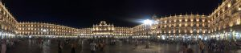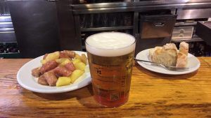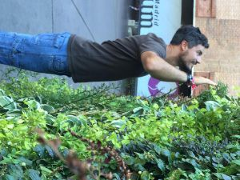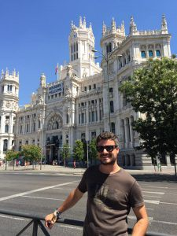

### Sziget 2016, Budapest, Hungary

Funny story: Last year I went to Sziget and was fascinated by the festival, people, program, attractions, lineup, etc. and decided to go again this year. Since the ticket for the whole week was 269€, and I couldn’t afford it at the time, I decided I’ll gamble and take a first day (one day) pass and try to stay on the festival island for the whole duration of seven days. It looks like it worked! :)  
 The Sziget festival is a unique experience. It’s more than just bands performing on stage. There’s yoga, massages, street performers that don’t have a specific schedule, you have to walk around to see them, there’s circus, actually two of them, there’s a theatre, bungee jumping, foam party, futsal, table tennis, League of Legends tournament, chess tournament, beach,…and almost every other kind of entertainment you can think of.

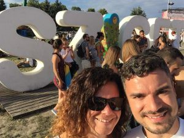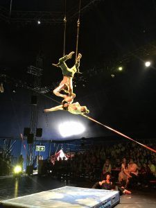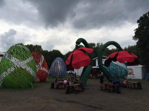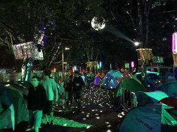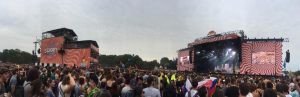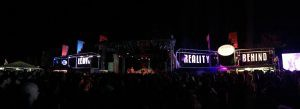

### 28th Birthday

I’ve made it. I outlived Kurt Cobain, Amy Winehouse, Jim Morrison and many others. :)  
 How do I feel about being 28? I feel fantastic! Never better, thanks for asking. I had a nice cosy birthday party on the beach in my hometown Split in Croatia, with my closest friends.

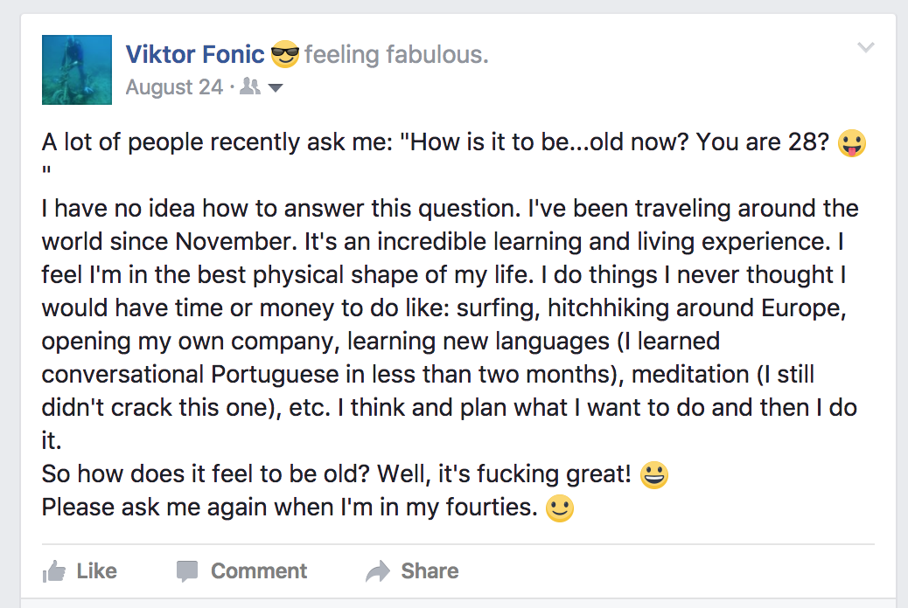

### Home, for The Last Time

I decided I’ll go back to my hometown Split and spend my last month and a half in Europe there. While being there I went on a wedding, played a game of Bocce (popular bowling game in Croatia), and got a scuba diving license.

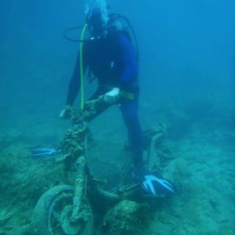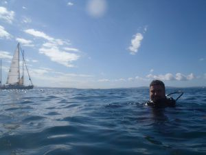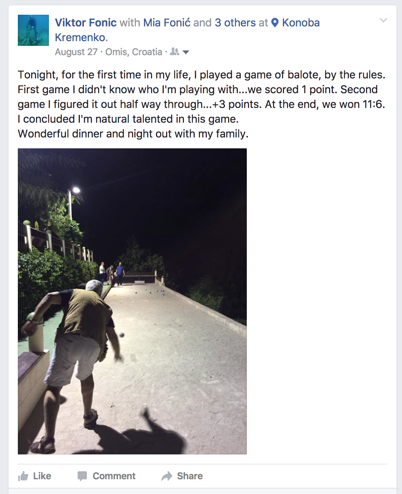

### One-way Ticket to Bangkok

When I wrote above “my last month and a half in Europe”, I meant it. After some more traveling around Europe, I boarded an airplane in Warsaw, Poland, flying one-way to Bangkok, Thailand. Of course I’ll come back to Europe, but I just don’t see it happening in the near future.  
 Since mid-October, I’ve been traveling around Thailand. I’ve visited some of the most beautiful beaches in the world in Krabi, tested my diving skills in the beautiful island of Koh Phi Phi, tried out wakeboarding, saw lantern festival in the digital nomads hub of the north Thailand — Chiang Mai and did a 600km road trip on a motorbike.

My friend Sasho said: “There are couple of decisions you make in life that completely change you forever.” This is definitely one of those decisions.

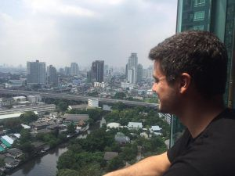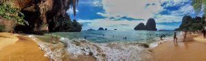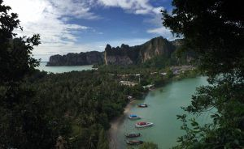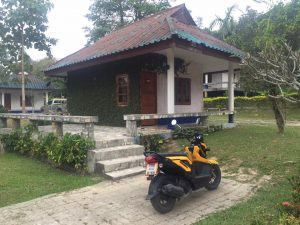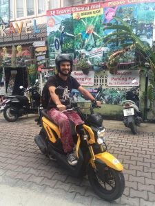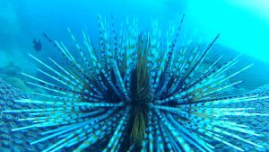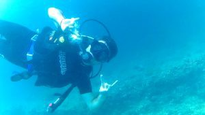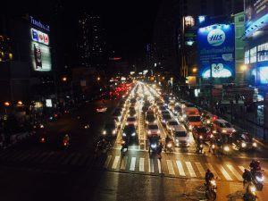

### Epilogue

I’ve learned a lot. I’ve partied a lot. I’ve experienced a lot of things I never thought I would. And I think everyone can do it. Think what you really want to do in your life and go and do it.

I think Aerosmith sums it up the best in their song Dream on:

> Dream on, dream on, dream on,  
>  Dream yourself a dream come true  
>  Dream on, dream on, dream on,  
>  Dream until your dreams come true

<Embed src="https://www.youtube.com/embed/XPL1uAosg-E?feature=oembed" aspectRatio={undefined} caption="" />

Things I learned:

1.  How to make lasagne
2.  Scuba diving
3.  Conversational Portuguese
4.  Conversational Spanish
5.  Learned to play Bocce

New experiences I had:

1.  Driving a motorbike for the first time in my life
2.  Wakeboarding
3.  Surfing

Other facts:  
 Weddings attended: 2  
 Festivals attended: 4  
 Kilometers traveled: +70,000km

PS I met a lot of great people on my trips last year. However, in this post, I tried to mention as fewer names as possible. I didn’t want to expose publicly lives of my friends who might not want that. So, to all the people I met in 2016: Thank you for being a part of my life. ❤️

Let’s see what 2017 brings!
