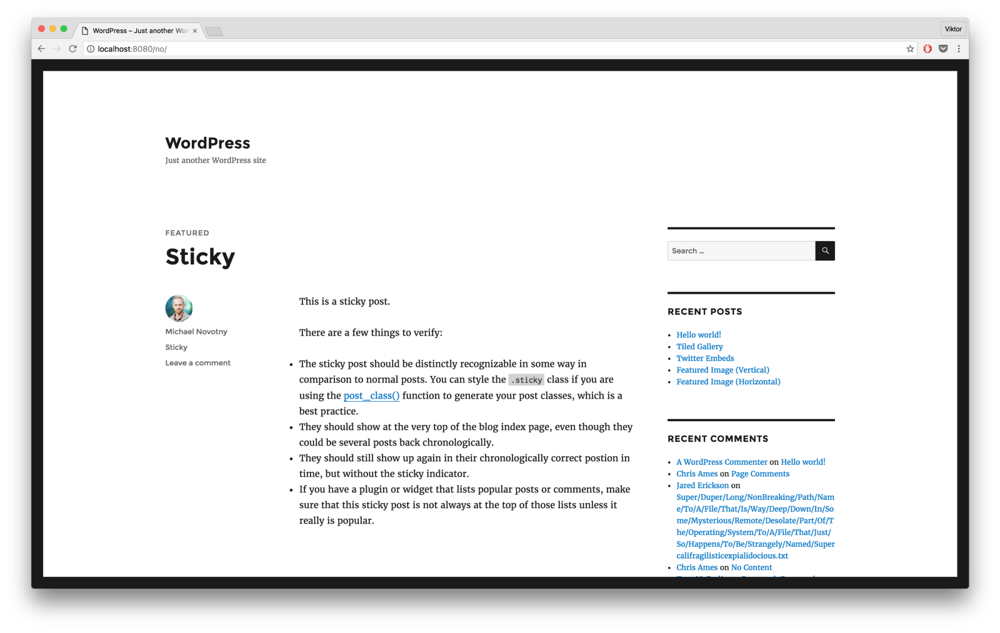
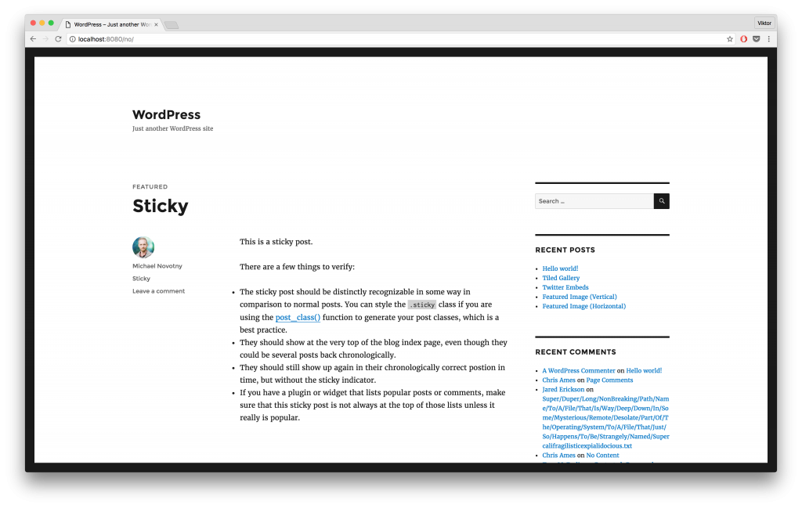

_Originally posted on:_ [https://viktorfonic.com/local-wordpress-development/](https://viktorfonic.com/local-wordpress-development/)

WordPress is, without a doubt, the most popular Content Management System (CMS). It now powers more than **27% of the internet**! \[1\] WOW! Here are some [More Surprising Statistics About WordPress Usage](https://managewp.com/statistics-about-wordpress-usage). It seems that it’s only getting more and more popular.

WordPress is a great platform if you want to use it professionally to [make money by building WordPress websites](http://viktorfonic.com/2016/11/24/become-digital-nomad/) for clients or by building a blog/portfolio for yourself.

If you want to become a WordPress expert, this is the tutorial for you.

In this tutorial I’ll show you how you can setup your local machine to start developing WordPress themes and plugins. This tutorial is written for macOS Sierra. There might be slight changes for other macOS versions. For Linux and Windows platforms, the differences can be bigger and you might be better of finding another tutorial.

### Local Development Advantages

By developing your WordPress themes and plugins locally, you can continue working even when you’re offline. All the changes that you make are stored on your computer which acts as a web server.

Since you’re developing everything on your own computer, everything is faster: page loads faster and files are updated the moment you save them.

Another benefit is that, locally, you can use Source Control Management (SCM) tools like [Git](https://git-scm.com) to keep a full log of all the versions and changes you’ve made on your theme. It also allows for easier collaboration between multiple people.

### Custom Install vs MAMP

One very popular way to setup local WordPress development is through custom-built tool [MAMP — Macintosh, Apache, MySQL, PHP](https://www.mamp.info/en/index.html). Even Smashing Magazine [wrote about it](https://www.smashingmagazine.com/2011/09/developing-wordpress-locally-with-mamp/). The main benefit of MAMP is easy installation and setup. It’s definitely the easiest way to start developing WordPress themes and plugins locally. The downsides? It’s opinionated, meaning there is one possible setup and a lot of assumptions. If you need to customize something, most likely you won’t be able to. If you start working for multiple clients, on multiple WordPress versions that need different MySQL, PHP or even Apache versions, you’ll be better off uninstalling MAMP and following the rest of this tutorial.

### Custom Install — The Recipe

#### 1\. Install and Setup Homebrew

For installation of most of the tools in this tutorial, you’ll have to have [Homebrew package manager](http://brew.sh) installed on your computer. The easiest way to install Hombrew is by running this command in the terminal:

```
$ /usr/bin/ruby -e "$(curl -fsSL https://raw.githubusercontent.com/Homebrew/install/master/install)"
```

Add some additional taps to Homebrew:

```
$ brew tap homebrew/dupes
$ brew tap homebrew/versions
$ brew tap homebrew/php
$ brew tap homebrew/apache
```

#### 2\. Install PHP and Apache

Let’s first install PHP and Apache. Although macOS Sierra comes with Apache 2.4 preinstalled, it doesn’t play nicely with Homebrew and you can’t update it to newer version via Homebrew if you don’t install it with Homebrew. That’s why we’re going to disable the macOS version of Apache and install and use the one by Homebrew.

We can install both PHP and Apache with the following command:

```
$ brew install php70 --with-apache
```

The above command will install both PHP 7.0 and Apache 2.4, which is great, since we need those two.

If you’ve already installed PHP, but without Apache, you can reinstall it:

```
$ brew reinstall php70 --with-apache
```

After the installation completes, you can check the PHP version installed by typing:

```
$ php -v
```

You should see something similar to this:

```
PHP 7.0.13 (cli) (built: Nov 24 2016 22:45:29) ( NTS )
Copyright (c) 1997-2016 The PHP Group
Zend Engine v3.0.0, Copyright (c) 1998-2016 Zend Technologies
```

Check out the Apache verion installed, too:

```
$ httpd -v

Server version: Apache/2.4.23 (Unix)
Server built:   Sep 27 2016 16:29:14
```

If you’re having problems with the last command: $ httpd -v, you can try installing Apache separately:

```
$ brew install httpd24 --with-privileged-ports --with-http2
```

#### 3\. Setup Apache

To setup the Apache we just installed, first we need to stop the macOS Apache from running:

```
$ sudo apachectl stop
$ sudo launchctl unload -w /System/Library/LaunchDaemons/org.apache.httpd.plist
```

Next, we’ll setup our Apache to launch on system startup. Keep in mind that you might have a different Apache version from 2.4.23\_2 in which case you should use that directory instead of the one below in the first command:

```
$ sudo cp -v /usr/local/Cellar/httpd24/2.4.23_2/homebrew.mxcl.httpd24.plist /Library/LaunchDaemons
$ sudo chown -v root:wheel /Library/LaunchDaemons/homebrew.mxcl.httpd24.plist
$ sudo chmod -v 644 /Library/LaunchDaemons/homebrew.mxcl.httpd24.plist
$ sudo launchctl load /Library/LaunchDaemons/homebrew.mxcl.httpd24.plist
```

Let’s also start up Apache server right away:

```
$ sudo apachectl -k restart
```

If you go to [http://localhost/](http://localhost/) you should see the famous “It works!” message. If it “Doesn’t work!”, try reading the error logs:

```
$ tail -f /usr/local/var/log/apache2/error_log
```

Next, let’s setup Apache to work with PHP. Depending on the version of PHP you installed, you’ll have to activate different PHP module for Apache. I’ll assume you’ve installed PHP 7.0 like I did, but in case you installed some other version, the setup is pretty similar. Edit the Apache configuration file in your favorite editor. Mine is [Atom](https://atom.io/) these days. Again, you might have Apache configuration in a different directory, but the file will most probably be called the same:

```
$ # it's good practice to backup the original file before editing it
$ cp /usr/local/etc/apache2/2.4/httpd.conf /usr/local/etc/apache2/2.4/httpd.conf$(date +%Y-%m-%d)
$ atom /usr/local/etc/apache2/2.4/httpd.conf
```

Near the top of the file, change the line Listen {some\_number} to Listen 80.  
 Next, enable module rewrite and PHP module. To enable a module, you just need to remove # from the beginning of the line. If the modules are already enabled, good. If they don’t exist in the config file, you can add them. Note the PHP version. Your version might be different:

```
LoadModule rewrite_module libexec/mod_rewrite.so
LoadModule php7_module    /usr/local/Cellar/php70/7.0.13_6/libexec/apache2/libphp7.so
```

Right below modules, set the user and user group (typically staff) for the Apache process. In my case it looks like this:

```
<IfModule unixd_module>
User viktorfonic
Group staff
</IfModule>
```

Setup the root directory from which Apache will serve files/websites. This is where I decided to put my WordPress development directory:

```
DocumentRoot "/Users/viktorfonic/Developer/WordPress"
<Directory "/Users/viktorfonic/Developer/WordPress">
    Options Indexes FollowSymLinks
    AllowOverride All
    Require all granted
</Directory>
```

To enable PHP code execution, replace:

```
<IfModule dir_module>
    DirectoryIndex index.html
</IfModule>
```

With:

```
<IfModule dir_module>
    DirectoryIndex index.php index.html
</IfModule>

<FilesMatch \.php$>
    SetHandler application/x-httpd-php
</FilesMatch>
```

You should also restrict some more files to be visible/served from your new Apache server, couple of lines below:

```
<FilesMatch "^\.([Hh][Tt]|[Dd][Ss]_[Ss])">
    Require all denied
</FilesMatch>

#
# Apple specific filesystem protection.
#
<Files "rsrc">
    Require all denied
</Files>
<DirectoryMatch ".*\.\.namedfork">
    Require all denied
</DirectoryMatch>
```

Let’s test that our new configuration is active:

```
$ echo "<?php phpinfo(); ?>" > /Users/viktorfonic/Developer/WordPress/info.php
```

Restart Apache to load new configuration:

```
$ sudo apachectl -k restart
```

And open [http://localhost/info.php](http://localhost/info.php).

You should see a bunch of info about PHP installation. Quite powerfull function that we just called!

#### 4\. Install MySQL and create database

With Homebrew, installing MySQL is very easy:

```
$ brew install mysql
```

Once installed, start MySQL server and login as root (that’s the default user):

```
$ mysql.server start
$ mysql -u root
```

Create “wordpress” (or any name) database and give yourself the absolute power (Note: _With great power comes great responsibility_ — Uncle Ben):

```
mysql> CREATE DATABASE wordpress;
mysql> GRANT ALL PRIVILEGES ON wordpress.* TO "viktorfonic"@"localhost" IDENTIFIED BY "some_password_here";
mysql> FLUSH PRIVILEGES;
mysql> EXIT
```

Please, please replace some\_password\_here with an actual password, and viktorfonic with your own user name.

#### 5\. Install wp-cli and Setup WordPress instance

[wp-cli](http://wp-cli.org/) is a convenient Command Line Interface package that allows you to easily setup your WordPress installation. We’ll use it here to setup our WordPress installation faster:

```
$ brew install homebrew/php/wp-cli
```

Let’s use wp-cli to download latest stable WordPress release, and configure and install it:

```
$ # let's go to our WP root
$ cd /Users/viktorfonic/Developer/WordPress
$ # create new directory for your new website
$ mkdir viktorfonic.com
$ cd viktorfonic.com
# download latest stable WordPress installation
$ wp core download
$ # configure WP installation (modifies wp-config.php)
$ wp core config --dbname=wordpress --dbuser=viktorfonic --dbpass=some_password_here
$  # these credentials are used to login to wp-admin
$ wp core install --url=http://localhost/viktorfonic.com --title=WordPress --admin_user=admin --admin_password=1234567890 --admin_email=viktor.fonic@gmail.com
```

Go to [http://localhost/viktorfonic.com](http://localhost/viktorfonic.com) to admire your new WordPress installation.

#### 6\. Final Bits and Pieces

Before you go crazy with your new WordPress installation, there are couple of steps left. These steps are not mandatory, but highly recommended.

#### Download clean \_s theme

The guys at Automattic, the company behind WordPress, have built a basic theme that can be a great starting point for theme development. The theme is called \_s (underscores). Head over to [http://underscores.me/](http://underscores.me/) and download your new theme. After you unzip it, place it inside your new WordPress installation, inside wp-content/themes directory.

#### Use git

I’d also highly recommend you keep track of the changes you make to your theme using git:

```
$ cd wp-content/themes/{your_theme_name}
$ git init && git add . && git commit -m "Initial commit"
```

You’d also want to keep track of any changes in your WordPress installation:

```
$ cd ..
$ cd ..
$ git init && git add . && git commit -m "Initial commit"
```

By having the whole WordPress installation in a git repo, you can track any changes that happen, whether from you installing plugins, themes, or just updating the WordPress installation. If anything breaks when you make changes to your WordPress installation, with git, you can always revert the changes.

#### Populate database with test data

There’s great test data for testing WordPress themes available online. We can get it with a simple command:

```
$ curl -OL https://raw.githubusercontent.com/manovotny/wptest/master/wptest.xml
$ wp import wptest.xml --authors=create
$ rm wptest.xml
```

### You are ready

Finally, you’re ready to start developing!

PS Great deal of this tutorial was inspired by [this tutorial](https://getgrav.org/blog/macos-sierra-apache-multiple-php-versions).

\[1\] [https://w3techs.com](https://w3techs.com)



Clean WordPress install
