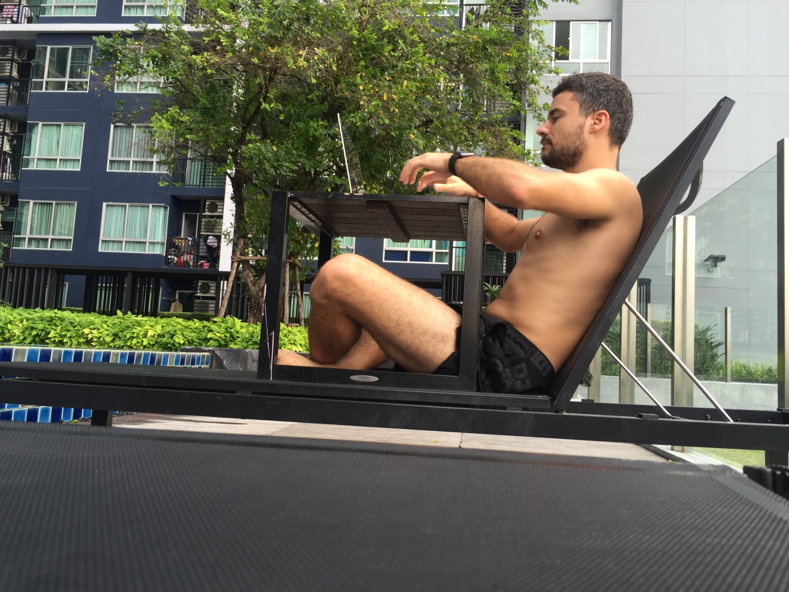

_Originally posted on:_ [_https://viktorfonic.com/become-digital-nomad/_](https://viktorfonic.com/become-digital-nomad/)

Remember that bar you visited last weekend? (I hope you do) It probably has a website.

Go to your local barber and tell him you build websites for living and he’ll ask you if you could make him one.

The protein store? They wish they had their own eCommerce website to sell those products online.

A shopping center, a lawyer, a private clinic, restaurant, airport, bus operator, sport club, tourist agency, library, organization, rock band, you name it.

Unfortunately, there’s not enough people with skills who can build websites and mobile apps that all these people and businesses need. Good news: it’s getting easier every day to build a website with just some clicking and drag&dropping. But how do you buy a domain? How do you connect a website to a certain domain? Where do you start?

#### Learn WordPress and/or Shopify

[WordPress](https://wordpress.org/) is the most popular platform for building websites. Apart from blogging it is used for a lot of other kinds of websites like: news portals, portfolios, business websites, etc. Check out [The Best WordPress Sites in the World](https://wordpress.org/showcase/).

You don’t need to dig into the WordPress code, which is by-the-way 100% [open source](https://github.com/WordPress/WordPress). All you need to learn is how to setup a new WordPress site on some hosting service, how to find and install a theme and how to connect the WordPress website with the domain.

For example: At the time of this writing, this website is hosted on [SiteGround](http://www.siteground.com/recommended?referrer_id=7462568) (_referral link!_) web hosting service, I’m using free [Independent Publisher Theme](https://wordpress.org/themes/independent-publisher/). The domain is purchased through [NameCheap](https://www.namecheap.com/).

[Shopify](https://www.shopify.com/) is another interesting platform. It’s the most famous and the easiest eCommerce platform that lets you create an eCommerce website in a matter of minutes: buy/get a theme, add some products, connect domain, start selling. It’s actually even easier than WordPress since you don’t have to take care of hosting, as the Shopify company provides hosting themselves.

There are numerous tutorials online for both of these platforms so I won’t go in details here. Be ready to spend couple of bucks to buy the domain and the hosting space, maybe even buy a premium domain.

#### How to Earn Money?

You can build websites for businesses that still don’t have a website (do these people still exist or are they extinct?) or for those whose website is poorly designed. A lot of people did this 15 years ago and it still works! Read this…now:

[**Screw Web 2.0 - Make Money with Simple Web Design - NevBlog**  
_When I was in high school, EVERYONE had started a "Web design company" at one point. It's such a simple way of making…_www.nevblog.com](http://www.nevblog.com/screw-web-2-0-make-money-with-simple-web-design/ "http://www.nevblog.com/screw-web-2-0-make-money-with-simple-web-design/")

Now go to your boss, quit your job and join me in Bangkok where you can build websites for western clients and live like a real Digital Nomad.
