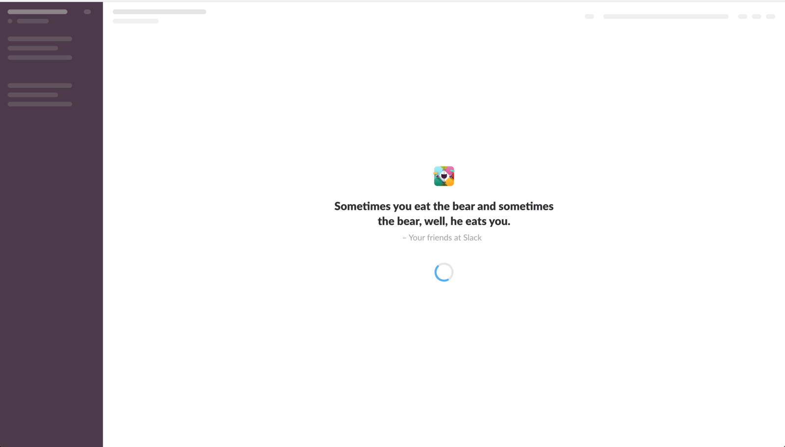

_Originally posted on:_ [_https://viktorfonic.com/css-animations/_](https://viktorfonic.com/css-animations/)

Here’s a simple blog post. I hope. Then again, it’s a blog post about animations and there’s a lot to be said how animations can ruin the UX. Just make sure everything jumps at the user when the page loads and it continues jumping, to the beating sound of your site’s background music.

Alright. Let’s talk about how animations can _enrich_ the UX.

_If you feel like, skip down to “Three steps to epiphany” to get to the meat of it._

### When to use animations?

Things shouldn’t just be jumping at the user. Animations should be used in one of these scenarios:

#### To show something is clickable

…and it leads to the next step, or is a main action. Don’t abuse this one. Use it subtly and only as a hint.

#### When something changed due to new data being available on the server

A good example of this is when twitter shows you there are new tweets. Imagine if twitter would instead load and show the new tweets as they arrive. You’d have hard time reading anything on your timeline as the new tweets would be jumping at the top all the time.  
 Instead, show a slight animation, updating the notification badge count, or slide down the new item to the list of items.

#### When user’s interaction with one part of the page changes another

For example, if user clicks on “Add to Cart” and you have a small cart icon in your navbar. You could animate the cart badge changing from 0 to 1 so that user notices there’s an item in the cart and that, most probably, he can click on the cart icon and continue to checkout.  
 Another example would be user choosing some form options that enable/disable other form options. Such as choosing “I want to add engraving to my iPad” checkbox. This checkbox could slide down a text field/area for user to add the engraving text. It would work “ok” without any animation, but what if you were choosing “free” vs “premium” package, where “premium” package included 10 extra fields not available in the “free” package. This already goes beyond just animations, but I hope you got the idea.

#### When something is loading

Now there’s a lot to say about loading times and loading spinners. Loading spinners make users percieve the content to be loading faster…or slower. It all really depends on [perceived performance](https://www.wikiwand.com/en/Perceived_performance). If the loading spinner is animated, user thinks something is happening. It’s obvious that something is happening, don’t you see the [progress bar moving](http://ricostacruz.com/nprogress/)? I’ve had users tell me: “the page is still loading”, but what was actually happening is that something broke and the page was not loading at all. It was just the loading spinner that was animated that kept the user thinking something is still loading. (Poor users of my websites, waiting eternally for a page to load. #badUX)  
 There’s a lot to say about loading spinners, I repeat. You can make them [interactive](https://codepen.io/hakimel/pen/KanIi), or put a fun fact in there, like Slack does. Or have content placeholders. These are neat little greyed out boxes of “potential” content layout that will be shown once the content loads.

I’ll talk more about loading spinners and content loaders in another blog post so let’s get back to simple animations.

### Three steps to epiphany

There are three main ingredients to a simple CSS animation™:  
 1. The Base styles  
 2. The Transition  
 3. The End styles

#### 1\. Setting up the Base

Let’s have a button that we want to animate on hover:

<Embed src="https://codepen.io/vfonic/embed/preview/ZvVbJN?height=600&slug-hash=ZvVbJN&default-tabs=css,result&host=https://codepen.io&embed-version=2" aspectRatio={undefined} caption="" />

We decided that our incredibly great animation will be a slight change of button’s background color.

Let’s add the base styles:

```
button {
  background: red;
}
```

Note that I added some more styles, but those are unrelated to what I’m trying to show you here.

#### 2\. The Transition

The `transition` CSS property tells us which other properties to animate, once we add the end styles.

```
button {
  background: red;
    
  transition: background 1s ease;
}
```

The syntax is simple and you can read more about it [here](https://css-tricks.com/almanac/properties/t/transition/).

#### 3\. The End styles

Let’s change button’s background on hover. Having added `transition` property earlier, it will ensure that the background color change will be animated:

```
button {
  background: red;
    
    transition: background 1s ease;
}
button:hover {
  background: rgba(255, 0, 0, 0.5); /* this is (almost) the same as just setting opacity: 0.5; The color is still red, but has opacity lowered to 50% */
}
```

Et voila! We’ve got our animated button!

<Embed src="https://codepen.io/vfonic/embed/preview/goZaRX?height=600&slug-hash=goZaRX&default-tabs=css,result&host=https://codepen.io&embed-version=2" aspectRatio={undefined} caption="" />

PS I’ve discovered that 0.3s is a great subtle animation duration.

You can also use this with a little bit of JavaScript:

<Embed src="https://codepen.io/vfonic/embed/preview/eybpjY?height=600&slug-hash=eybpjY&default-tabs=html,result&host=https://codepen.io&embed-version=2" aspectRatio={undefined} caption="" />

Instead of animating your HTML elements using JavaScript functions (such as jQuery’s “slideUp”, “fadeIn”, etc.), you can achieve the same effects (for most animations), doing nothing more, but adding a class to the HTML element. Are there any benefits from using pure CSS, instead of calling a JavaScript function, you ask? There are couple of benefits. For one, it’s faster. Browsers can more easily optimize CSS animations than the ones created by JavaScript. You also don’t have to worry whether the element is already animating, such as in our fade-in/out with toggle button example above.

Next time we’ll talk about the real CSS animations, popularly known as: `@keyframes`
