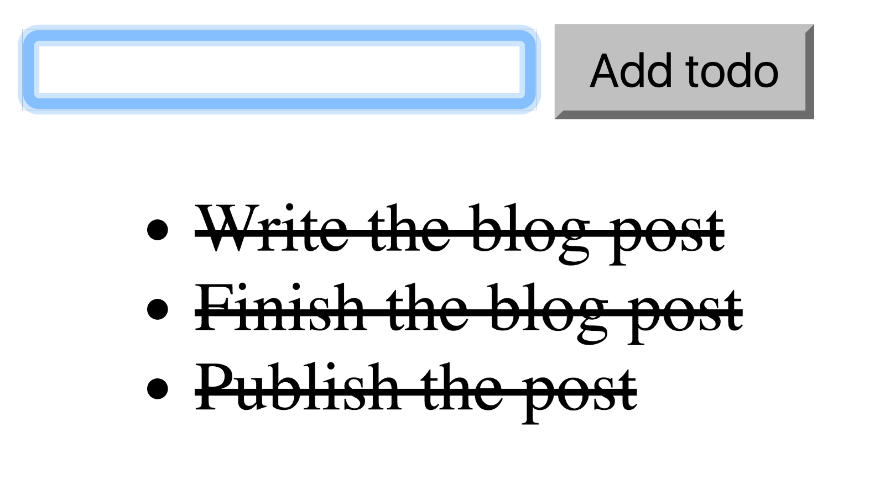

_Originally posted on:_ [_https://viktorfonic.com/start-using-redux_](https://viktorfonic.com/start-using-redux)

_This is a blog post about how I started using_ [_Redux_](https://github.com/reactjs/redux) _in my web applications._

### Prerequisites

Barely any! This tutorial uses the “old school” way of writing apps and therefore doesn’t require you to know anyting more than the basic understanding of JavaScript and jQuery. No ES6, no Babel, no Webpack, no npm. If you know how to use these tools, it will be easy for you to integrate the knowledge from this tutorial in an app that uses any of these. If you don’t know how to use these tools, consider learning them, as they can get really useful.

### What you will learn

-   Using Redux with vanilla JavaScript and/or jQuery-powered apps
-   Writing simple Redux reducers
-   Writing tests with Jasmine

### Prologue

Writing front-end JavaScript code has been an issue since the existence of the front-end. Back in days, we used to write everything in one huge jQuery-powered file with bunch of $(‘some\_selector’).click(function() {…}); and similar. This was bad for several reasons:

-   it was hard to reuse any piece of code
-   it was hard to understand what’s going on, who’s calling who, etc.
-   it was hard to write tests and therefore to ensure nothing will break when making changes

Luckily we evolved from this practice. A lot of front-end frameworks emerged, separating various parts of the application, for example separting business logic from presentation layer, separating communication with API from displaying the data and so on. These frameworks do pretty good job.

One such framework/concept that gained a lot of popularity lately is: [Redux](https://github.com/reactjs/redux). Although people use it a lot together with [React](https://facebook.github.io/react/) framework, that is not necessary and Redux can be used separately.

If you’re not familiar with Redux, it might be overwhelming to start using it immediately. Even adding it to a React application can be a challenging and confusing at first. Here’s how I started using Redux as a concept and I think you should do the same.

### TODO List Application

Let’s build a simple TODO list application together. The app will provide this basic functionality:

-   Add a TODO
-   Mark TODO as completed

### A State Machine

If you studied computer science, you probably learned about state machines. [State machine](https://www.wikiwand.com/en/Finite-state_machine) is a “machine” with the following characteristics:

-   It has states (thank you Captain Obvious!)

In our case this is the list of TODOs with their titles and completion statuses:

```
[ { title: "Write the blog post", completed: false }, { ... } ]
```

-   It has defined state transitions

When state machine receives an input/message/action, it can change its state, to a different, exactly defined, state. For example:  
 If this is our current state:

```
[ { title: "Finish the blog post", completed: false } ]
```

And the “action” sent to the machine is: “Add a TODO” with title: “Publish the post”, our new state will be:

```
[
    { title: "Finish the blog post", completed: false },
    { title: "Publish the post", completed: false }
]
```

As you can see, our machine is always in a consistent state. This allows us to easily debug our application.

-   It has an initial state

Initial state is the state the machine starts in, right after we launch our application. In our example, the initial state is an empty list of TODOs:

```
[ ]
```

### Redux and State Machine

Before continuing, please watch first 12 videos from amazing Redux video tutorial, done by the creator of Redux himself [@dan\_abramov](https://twitter.com/dan_abramov). The first 12 videos are 32 minutes long. Take your time. You don’t have to follow through the examples, as we’ll write very similar app:  
 [Getting Started with Redux](https://egghead.io/courses/getting-started-with-redux)

Redux is essentially an implementation of a state machine. It has a lot of extra benefits/functionality, but we’ll focus on state machine now. When we initialize our app, we create a Redux state machine with **initial state**. When we want to change the state (make a state transition to another state), we **dispatch an action** to the state machine. At any time we can **get the current state** of the app and use it in our code. You can also **subscribe** to state changes in order to perform custom actions when the state changes. This is the main way of using the state machine.

The basic Redux API consists of the three main functions: getState, dispatch and subscribe. getState gets the current application state, dispatch allows you to dispatch an action to change the app state and subscribe allows you to subscribe to be notified when the state changes. For example:

```
function printState() {
  var state = todosMachine.getState();
  console.log(state);
}

todosMachine.subscribe(printState);
```

The above code prints to the console the full app state every time the state changes.

Here’s the full implementation of basic “Redux” API:

```
// The state machine that keeps the state of certain part of the application
// or whole application.
// It is possible to subscribe as many listeners as wanted to perform certain
// actions on state change.
function StateMachine(inputProcessor) {
  // private machine state, not exposed publicly
  var state;
  // array of subscribed listeners
  var listeners = [];

  // the immutable machine state
  function getState() { return state; };

  // the only way to change the machine state
  // action parameter must contain type property
  // additionally it can contain any other arbitrary data needed for action
  // to be performed
  // example:
  // action = {
  //   type: 'REMOVE_TODO',
  //   id: 5 // the id of the todo being removed
  // }
  function dispatch(action) {
    // call state changing function
    // this function must take two arguments: state and action object
    state = inputProcessor(state, action);
    // notify all subscribed listeners
    listeners.forEach(function(listener) { listener(); });
  };

  // subscribe a new listener
  // if you want to unsubscribe, this function returns a function that can be
  // called to unsubscribe
  // example:
  // var sm = StateMachine(todosProcessor);
  // var unsubscriber = sm.subscribe(printState);
  // unsubscriber(); // unsubscribed!
  function subscribe(listener) {
    listeners.push(listener);
    return function() {
      listeners = listeners.filter(function(l) { l !== listener; });
    };
  };

  // dispatch a dummy action to get the initial state populated from inputProcessor
  dispatch({});

  // state machine public API
  // you can only call these three methods to interact with state machine
  return {
    getState: getState,
    dispatch: dispatch,
    subscribe: subscribe
  };
};
```

To instantiate new state machine, just call the StateMachine() function:

```
var todosMachine = StateMachine(someStateChangingFunction);
```

### Implementing TODOs State Machine

-   Create a new directory in your development directory called redux\_lite\_todo.
-   Inside that directory create index.html with the following content:

```
<script src="https://code.jquery.com/jquery-3.1.1.slim.min.js"></script>
<script src="state_machine.js"></script>
<script src="todos_reducer.js"></script>
<script src="app.js"></script>
<style>
.is-completed {
  text-decoration: line-through;
}
</style>
<input type="text" id="todoInput">
<button id="addTodoButton">Add todo</button>
<ul id="todos">
  <li>Loading TODOs...</li>
</ul>
```

We’re going to use jQuery for the sake of code readability.

-   Create an empty app.js file. We’ll add our main JavaScript app code here.
-   Create state\_machine.js and copy-paste the above StateMachine source code.
-   Create todos\_reducer.js where we’ll define the above mentioned someStateChangingFunction, except this time we’ll give it a more meaningful name.  
     The state changing functions are very simple, pure functions that always return the new state object, never modifying original state. These functions are called **reducers**. The easiest way to implement such functions is with switch-case statements. Here’s the first version of our todos\_reducer.js:

```
function todosReducer(state, action) {
  // the initial state
  if (typeof state === 'undefined') {
    state = [];
    return state;
  }

  switch (action.type) {
    case 'ADD_TODO':
      return state;
    case 'TOGGLE_TODO':
      return state;
    default:
      return state;
  }
}
```

Notice how all case statements return so there’s no fallthrough from one case statement to another. Also, it’s a good practice to always have a default statement return the original state. This is more used in bigger apps that have many reducers where not all the actions are relevant to every reducer function. For example, we can have a separate reducer for sorting TODOs, hiding completed TODOs or for something completely unrelated like user data. If our reducer would receive an unknown action type like SORT\_TODOS, it would simply return the unmodified current state. This is exactly the behavior that we want.

### Testing with Jasmine

Now that we have a scaffold of our reducer function, let’s write the tests, covering the usage of the reducer. We can write the implementation as we are writing tests. For the testing purposes, we’ll use [Jasmine](https://jasmine.github.io/), a behavior-driven development framework for testing JavaScript code. Jasmine is one of the most popular JavaScript testing frameworks and it’s very easy to setup as a standalone testing framework, meaning: low overhead and no external dependencies.

-   To setup Jasmine for testing, [download a jasmine-standalone archive from github](https://github.com/jasmine/jasmine/releases/download/v2.5.2/jasmine-standalone-2.5.2.zip) and extract it in the root of your redux\_lite\_todo directory.
-   Rename the jasmine-standalone-2.5.2 directory to test.
-   Remove the ./test/src directory as we won’t be using it.
-   Remove all the files inside ./test/spec, but keep the directory. This is where we’ll put our tests.
-   Replace the contents of ./test/SpecRunner.html with the following code:

```
<!DOCTYPE html>
<html>
<head>
  <meta charset="utf-8">
  <title>Jasmine Spec Runner v2.5.2</title>

  <link rel="shortcut icon" type="image/png" href="lib/jasmine-2.5.2/jasmine_favicon.png">
  <link rel="stylesheet" href="lib/jasmine-2.5.2/jasmine.css">

  <script src="lib/jasmine-2.5.2/jasmine.js"></script>
  <script src="lib/jasmine-2.5.2/jasmine-html.js"></script>
  <script src="lib/jasmine-2.5.2/boot.js"></script>

  <!-- include source files here... -->
  <script src="../state_machine.js"></script>
  <script src="../todos_reducer.js"></script>

  <!-- include spec files here... -->
  <script src="spec/todos_reducer_spec.js"></script>

</head>

<body>
</body>
</html>
```

-   Create a new file in ./test/spec called todos\_reducer\_spec.js.

There are several things we want to test:  
 1. Initial state is set correctly  
 2. Adding a TODO  
 3. Toggling TODO completed/uncompleted  
 4. Any other action correctly returns previous state

#### 1\. Initial State is Set Correctly

Here’s our first Jasmine test (spec) in todos\_reducer\_spec.js:

```
describe('todosReducer', function() {
  var todosMachine;

  beforeEach(function() {
    todosMachine = StateMachine(todosReducer);
  });

  it('sets the correct initial state', function() {
    expect(todosMachine.getState()).toEqual([]);
  });
});
```

Let’s explain a bit what is happening over here:

-   We call Jasmine’s describe() function that helps us structure and group our tests and also execute certain actions for groups of tests as we’ll see later
-   The first argument to describe() is the name of the subject of our testing. In this case it’s our todosReducer
-   The second argument is a function with all the describe() and it() nested functions that fit under the main describe() subject. In our case, we’ll put here all the tests for our todosReducer.
-   The beforeEach() function creates a new state machine that we’ll use to run the tests against. We won’t write the tests for the StateMachine itself. We’ll assume that it’s an existing library that we just downloaded. We will test it indirectly in a way, by using its API.
-   The call to it() function is a single test itself.
-   First argument serves as an explanation of what we’re testing, what kind of result is expected.
-   Inside the function we get the state machine state and make sure it equals to an empty array.

Open ./test/SpecRunner.html in your favorite browser and make sure the test passes.

#### 2\. Adding a TODO

Next up, let’s write a test for adding a TODO (inside of describe(‘todosReducer’, function() {…}):

```
it('adds a new todo', function() {
    todosMachine.dispatch({
      type: 'ADD_TODO',
      payload: 'Write a third test'
    });

    var expectedState = [{
      id: jasmine.anything(),
      title: 'Write a third test',
      completed: false
    }];
    expect(todosMachine.getState()).toEqual(expectedState);
  });
```

We use jasmine.anything() for TODO ID value, because we don’t care how the IDs are generated/assigned. They could be simple integers, like in our current implementation, or they could be MongoDB ObjectIds or anything else.

If you refresh your browser now, you can see that our test fails. That’s because we haven’t written the code for adding a new TODO in our todos\_reducer.js. Let’s do that now:

```
switch (action.type) {
    case 'ADD_TODO':
      // action.payload is the new todo's title
      var todo = {
        id: nextTodoId++,
        title: action.payload,
        completed: false
      };
      var newState = state.concat([ todo ]);
      return newState;
    (...)
  }
```

Notice how we create a new state by calling concat() method that doesn’t modify the original state array (unlike state.push(todo) would).

#### 3\. Toggling TODO Completed/Uncompleted

I’m going to create two tests here. First I’d like to test that the TODO’s state changes from uncompleted to completed and then I’d like to test toggling back from completed to uncompleted.

**Toggling TODO Completed**

```
it('marks todo as completed', function() {
    // ARRANGE
    todosMachine.dispatch({
      type: 'ADD_TODO',
      payload: 'Write a third test'
    });
    var todo = todosMachine.getState()[0];

    // ACT
    todosMachine.dispatch({
      type: 'TOGGLE_TODO',
      payload: todo.id
    });

    // ASSERT
    var expectedState = [{
      id: todo.id,
      title: todo.title,
      completed: true
    }];
    expect(todosMachine.getState()).toEqual(expectedState);
  });
```

In this test, I’ve also added a comments to describe different parts of our test “lifecycle”: Arrange, Act and Assert. Make sure to read more about this concept if you’re not familiar with it.

**Toggling TODO Uncompleted**

Let’s write a test for toggling TODO uncompleted and then we’ll implement the functionality:

```
it('marks the completed todo as uncompleted', function() {
    // ARRANGE
    todosMachine.dispatch({
      type: 'ADD_TODO',
      payload: 'Finish the blog post'
    });
    var todo = todosMachine.getState()[0];
    todosMachine.dispatch({
      type: 'TOGGLE_TODO',
      payload: todo.id
    });

    // ACT
    todosMachine.dispatch({
      type: 'TOGGLE_TODO',
      payload: todo.id
    });

    // ASSERT
    var expectedState = [{
      id: todo.id,
      title: todo.title,
      completed: false
    }];
    expect(todosMachine.getState()).toEqual(expectedState);
  });
```

Here, we don’t test again the state after dispatching TOGGLE\_TODO for the first time. We covered that in the previous test. In this test, that call is part of Arrange step.

And here’s the implementation of toggling TODO in our reducer:

```
switch (action.type) {
    (...)
    case 'TOGGLE_TODO':
      var newState = state.map(function(todo) {
        // action.payload is the todo's id
        if (todo.id === action.payload) {
          var newTodo = Object.assign({}, todo, {
            completed: !todo.completed
          });
          return newTodo;
        }
        return todo;
      });
      return newState;
    (...)
  }
```

Couple of things to note:

-   The map() method executes a function for each element of the array, creating a new array from returned values. It doesn’t modify the original array.
-   We use Object.assign() method here, again to avoid modifying the original todo object.

#### 4\. Any other action correctly returns previous state

Let’s write a simple test for this one:

```
it('does not change the state for unknown action', function() {
    var beforeState = todosMachine.getState();

    todosMachine.dispatch({
      type: 'SORT_TODOS'
    });

    var afterState = todosMachine.getState();
    expect(afterState).toEqual(beforeState);
  });
```

We have already implemented the code necessary for this test to pass.

### Wiring It All Together

Let’s write some ugly jQuery code that wires it all up together. We won’t write tests for this code, as it’s hard to write them because of the dependency on jQuery and DOM. And this code you should anyway replace by something like React. We’d be better off using React or similar library, but for the sake of simplicity, we’re using good ol’ jQuery.  
 Put this code in your app.js file:

```
$(document).ready(function() {
  var todosMachine = StateMachine(todosReducer);

  function addTodo() {
    var $todoInput = $('#todoInput');
    var todoTitle = $todoInput.val();

    // reset todo input value
    $todoInput.val('');

    // dispatch add new todo action
    todosMachine.dispatch({
      type: 'ADD_TODO',
      payload: todoTitle
    });
  };

  function toggleTodo() {
    var $todoNode = $(this);
    var todoId = $todoNode.data('id');

    todosMachine.dispatch({
      type: 'TOGGLE_TODO',
      payload: todoId
    });
  };


  var $todoButton = $('#addTodoButton');
  $todoButton.click(addTodo);


  function render() {
    var todos = todosMachine.getState();

    var $todosContainer = $('#todos');
    $todosContainer.empty();

    todos.forEach(function(todo) {
      var $todoNode = $('<li>');
      $todoNode.text(todo.title);
      $todoNode.data('id', todo.id);
      $todoNode.toggleClass('is-completed', todo.completed);

      $todoNode.click(toggleTodo);

      $todosContainer.append($todoNode);
    });
  }

  todosMachine.subscribe(render);
  // initial render
  render();
});
```

We won’t analyze this code in too many details. But still, let’s give it a simple look:

-   First we create our todosMachine by passing our todosReducer that we heavily tested in a different file.
-   We create addTodo() function that executes on “Add todo” button press and dispatches ADD\_TODO action.
-   toggleTodo() function looks similar. Except that it fires by clicking on a TODO’s <li> DOM element that contains data-id=”{todo.id}” attribute.
-   Lastly we create render() function and subscribe to todosMachine’s changes so that it’s called every time the app state changes. For example when we add a new TODO or toggle a TODO.

This is all we need to have the app working. Refresh your browser and enjoy your new TODO list app!

### Next Steps

1.  You can start using this state machine in your apps today! You can find the complete source code on this GitHub project: [vfonic/redux\_lite\_todo](https://github.com/vfonic/redux_lite_todo).
2.  Finish watching the rest of [Getting Started with Redux](https://egghead.io/courses/getting-started-with-redux) videos.
3.  Integrate React in your existing app (this is going to be my next blog post).
4.  Learn/use Babel, Webpack, eslint, npm/yarn, node/hapi
5.  Take over the world.

If you have any questions, I’ll be on twitter.

[Follow me on twitter.](https://twitter.com/vfonic)
