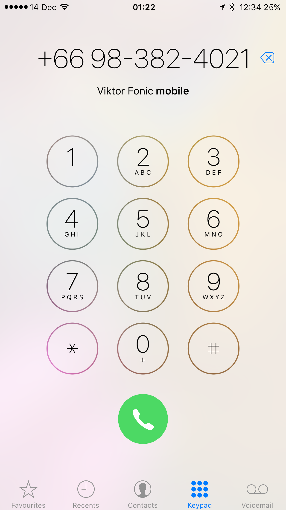

_Originally posted on:_ [_https://viktorfonic.com/mobile-phone-numbers_](https://viktorfonic.com/mobile-phone-numbers)

> I’m not a number, I am a free man. — Number 6, The Prisoner

In this blog post I want to talk about the user experience of an archaic [technology](https://hackernoon.com/tagged/technology) that we got used to live with. We don’t even consider it archaic and we’re numb to all the little nuances it has: The [mobile](https://hackernoon.com/tagged/mobile) phone numbers.

### The Internet

Did you ever wonder how accessing a certain website works? Behind that familiar name like [https://www.facebook.com/](https://www.facebook.com/), there’s a certain number, so called IP address, that your browser needs to “dial”. Your browser doesn’t automatically know where facebook.com is located and needs to first find its “number”. There are several Domain Name Servers (DNS) in the world that serve like an address book. Their numbers never change, so your browser can always call them to ask about “the phone number” of facebook.com or google.com or any other website you visit. After the server gives the number, your browser “calls” to facebook.com.  
 Why is this not possible to do the same for mobile phone numbers? I don’t know. The technology is there. It’s been there for years.

### Who Would Pay For This Service

Great question! Thanks for asking! The similar question to ask is: Who is paying for the DNS servers?  
 There are numerous organizations who support the work of DNS servers, like: government institutions, universities, etc.  
 Would this model work in mobile phone industry, too? I think it would. Google could probably have this service running for free. If not, you can always charge customers a symbolic fee to setup their alias name that they would like to use instead of a phone number.

### Phone Number is the new Social Security Number

To this day, we still use phone numbers all over the place. When I moved from Croatia to Ireland, I didn’t buy the SIM card (phone number) immediately. It was a very painful experience. I tried to open a bank account, but I was told that I need to have a phone number if I want to do it. I went online to order a SIM card from one of the country’s telephone companies (telcos). Unfortunately, I couldn’t submit the form for requesting a new SIM card because one of the required fields was “Previous phone number”. I didn’t have any functional “Previous phone number” as I threw away my Croatian SIM card couple of months ago when I went to China before heading to Ireland (it was on the way, I swear!). I finally managed to buy a SIM card, and a notification from Whatsapp confirmed that: Mobile phone number changed. If you want to transfer chats from your old phone number, you need to type the verification code we sent you to your old phone number. Great. I just lost my complete Whatsapp chat history.

Did phone numbers become like a social security numbers? I see mobile phone numbers used more and more as an identification number on which official institutions can reach you. This is not necessarily a bad thing. But it’s also not necessarily a good thing.

---

Fast-forward couple of years later. I was leaving Ireland. I was about to start a 6-months trip around Europe. And, in 2016, roaming rates were still quite high in Europe and every country had its own telco companies, with its own SIM cards. So I opted for not having a phone number. People look so weirdly at you when you tell them you don’t have a phone number. But think of it for a second. Mobile phone number is just one very primitive app on your phone that has voice calls and chat functionality. There are at least 5 alternatives that I can remember in 2 seconds. The only true value of SIM cards are data plans. However, getting a new SIM card can be a real problem sometimes.

### GSM vs CDMA

There are two most popular technologies in mobile phones: GSM and CDMA. GSM phones are the phones which require SIM card. On the other hand, CDMA phones don’t require a physical SIM card (is the future already here?). Ok, we just proved it’s possible to have a phone connected to a mobile network without a physical SIM card. Can we take this a step further?  
 Have you ever been at the airport? Tried to connect to an open WiFi when it suddenly presented you with this popup screen asking you to login and pay ~5€/hour? Now imagine crossing the border, connecting to a new telco and being prompted to choose a data plan (or a phone number). This would be great! I’d purchase new phone number / data plan every time I’d cross the border. Telcos would profit from this and I wouldn’t have to spend time researching the best package (I will be presented with the options right in the popup on my phone). I wouldn’t have to go to a shop to buy SIM card and I wouldn’t have to go back to the same shop to top-up my SIM card. Seriously, in most of the countries around the world (I’m talking about pre-paid here), you have to go to the shop to top-up your mobile phone credit. <sarcasm>I don’t know if you’ve heard of this revolutionary technology called online payment where you put your credit card details in a website and it sends money to a company across the world to pay for some service or product. It’s truly magical (and it’s been around for more than 20 years).</sarcasm>  
 Really, the only thing you should need to do, when you buy a new phone, is login. After you login, your phone gets your phone number and all your friends (and enemies) can call you.

### Usernames

Remember the DNS story? Imagine having your own alias that you could give to your friends and always be reachable there, no matter the phone number? Go to another country, across the globe, get a SIM card, or simply login, and update your phone number so your friends can reach you. The username could look like a website domain so we can have new set of usernames for every country: vfonic.hr.person

### Privacy

What if you didn’t want everyone to know your phone username? You could create a temporary username that expires after certain period of time, or after someone calls you (one-time username). For example: viktor\_in\_bangkok.th.person  
 You could even create a username for your car’s license plate if you wanted people to reach you, for example, when your car is not properly parked.  
 Would this work? It already does. Do you have a Skype account? How about Google Hangouts? These are the accounts that everyone can use to reach you and, altough there are a lot of spambots, the system works.  
 You wouldn’t believe me, but there was a small startup from Slovenia who was trying to achieve just this back in 2011: [Vox.io on AngelList](https://angel.co/vox-io). I don’t know what happened with them, as latest news from the end of 2012 were that they had 1 million users and were integrating with Facebook Messenger (in 2012!).

### Conclusion

Telcos are slowly losing more and more of the mobile industry pie. It’s similar to what’s happening in the banking industry: A lot of software companies are taking the pie piece by piece. For example Apple took a huge step towards removing SMS messaging when it introduced iMessage. Google followed by integrating SMS messages in Google Hangouts app. International calls? Telcos already lost that battle. MMS? What is that?  
 Telcos need to step up their game or they will be eliminated when someone like Google or Facebook make Internet available for everyone everywhere. The phone number user experience is broken and must be fixed.

> [Hacker Noon](http://bit.ly/Hackernoon) is how hackers start their afternoons. We’re a part of the [@AMI](http://bit.ly/atAMIatAMI) family. We are now [accepting submissions](http://bit.ly/hackernoonsubmission) and happy to [discuss advertising & sponsorship](mailto:partners@amipublications.com) opportunities.

> If you enjoyed this story, we recommend reading our [latest tech stories](http://bit.ly/hackernoonlatestt) and [trending tech stories](https://hackernoon.com/trending). Until next time, don’t take the realities of the world for granted!

