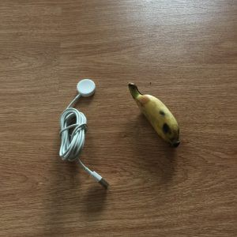

_Originally posted on:_ [_https://viktorfonic.com/whats-in-my-bag_](https://viktorfonic.com/whats-in-my-bag)

As I’m traveling around the world with all my belongings fitting into a single backpack (actually a backpack and a rucksack), I want to show you what I have in my rucksack aka daily bag.  
 I’ve seen some bloggers, like a founding developer of WordPress — Matt Mullenweg, write a [blog post](https://ma.tt/2016/03/whats-in-my-bag-2016-edition/) about what’s in their daily backpacks. So here’s mine.

PS Please note that I use midget [banana for scale](http://knowyourmeme.com/memes/banana-for-scale). I always carry a midget banana in my rucksack so that I can measure things correctly.

#### What’s in My Bag v1.0

1.  **The bag**

1.  First the bag itself. There’s a funny story around how I got this bag. I was attending some Microsoft event presentation at my faculty, 4–5 years ago (!). Towards the end of the talk, the presenter said there will be a giveaway of branded items, including: a mouse, a USB stick, a mug and a rucksack (this one). I needed a descent laptop rucksack, as my old sport rucksack didn’t offer any protection for my laptop. I turned to my friend and said: “You see that rucksack? It’s mine.” At the end of the presentation, the giveaway started. The presenter would first announce what is going to be given away and then he would pick a paper with a student’s name out of an improvised hat. For every item he announced for giveaway, I turned to my friend and said: “No, not me.” I was waiting until he announced the rucksack. Then I said: “Yep, this one.” The presenter picked up a piece of paper and read loudly: “Viktor Fonic”. I stood up, smiling from ear to ear, walked over and picked up my new rucksack. My friend was looking at me completely confused. Of course it was pure luck, but I like to believe I somehow influenced the destiny of getting that rucksack by being so sure I’ll get it.
2.  **Laptop case**

1.  I use it to add a little bit more protection, especially at the bottom of the rucksack as sometimes I hear a thud when I put my rucksack down. (Whooops!)
2.  **Google notebook**

1.  I’m always on the lookout for the notes with pages with squares instead of blank pages or with lines. It’s easier to write some code or do math calculations. Plus my handwriting and drawing skills are something even doctors would be proud of, so it’s easier to do small mockup drawings with some guiding lines. I took this notebook from Google’s office in Zurich when I went there two years ago for an on-site interview.
2.  **Apple headphones**

1.  These came with the iPhone.
2.  **Labello lip balm**

1.  It helps with dry lips.
2.  **Pen**

1.  I got this pen on my friend’s wedding one year ago.
2.  **Passport**

1.  This is my “international ID”. I carry it around with me all the time.
2.  **Tesco Ireland SIM card**

1.  I need this one to verify that me is me for my Bank of Ireland account. I also need it for some other stupid services (like Whatsapp) that think [phone numbers](mobile-phone-numbers/) are permanently tied to a person.
2.  **Padlocks**

1.  I use these to lock my bag when I have to leave it somewhere like above my seat on a bus or near my bed in a hostel. When I leave it in the hostel, I wrap my MacBook charging cable around the bed pole while keeping one side of the loop locked inside of the bag. This ensures that no one can open the bag or steal it when it’s locked.
2.  **Condoms**

1.  For blowing baloons when I’m bored
2.  **Documents envelope**

1.  In here I have a copy of my passport, passport-size photos (mostly used for visa applications) and health insurance documents
2.  **Travel adapter**

1.  Has two USB ports, supports USA/UK/EU outlets. Costed 10€ in Bangkok.
2.  **Kobo Aura e-reader**

1.  Bought it two years ago and love it. I don’t use it every day and sometimes I don’t use it for days/weeks/months. But when I do…it’s handy to have distraction-free e-reader. Another benefit is that I can carry around unlimited (4GB) amount of books in just 180g of weight. I just started reading The Motorcycle Diaries by Ernesto Che Guevara.
2.  **20,000 mAh Powerbank**

1.  My dad bought me this one for my birthday. I don’t use it much, but sometimes it’s a life saver. I wish I could charge my Mac with it…
2.  **USB to mini-USB cable**

1.  **USB to lightning cable**

1.  **USB to…to…oh well, it’s an Apple Watch charging cable (need more cables!)**

1.  **MacBook UK charging cable with EU adapter attached**

1.  **Fish-eye lenses**

1.  These are great for taking, you guessed it, fish-eye photos. Costed me about 3€ in Bangkok.
2.  **Protein shaker**

1.  I use it as a water bottle in my daily bag. Sometimes, when I exercise, I also use it as a protein shaker.
2.  **Coffee/tea bottle**

1.  I got this one here in Bangkok, for free, when I bought a tea at the metro station. It was for free. It’s pretty good material and probably costly to be given for free. Nevertheless, I decided to keep it to reduce my garbage footprint. I drink tea or coffee every day. And it happens to mostly be a takeaway, so I reuse this bottle.
2.  **MacBook Pro 13'’ retina**

1.  Bought this little gem almost two years ago. I’m very satisfied with it and have no intention on buying new MacBook Pro with TouchBar. I think I’ll buy this one again, second hand, when this one completely gives up on me. The custom Apple logo sticker, that’s supposed to look like a world map, was my own work. I couldn’t find similar sticker so I just bought black sticker and cut the world map out. It took me probably more than an hour to cut it out and it probably looks horrible, but I’m going to keep it for now anyway.
2.  **Apple Watch**

1.  This one is not actually in the bag. I usually have it on my wrist.
2.  [**Secrid wallet**](https://www.secrid.com/en/product/id/3/item/112/miniwallet-vintage-chocolate)

1.  This half-size full wallet with RFID protection is awesome.
2.  **Sunglasses**

1.  I chose thug life.

#### That’s it?

Hmmm, yeah. I surprised myself when I saw the list is over and there are only about 20 items in there! I even added all the cables one by one.

#### Other gear

Apart from this, I only have an iPhone 6+ with me. This little guy ends up in the bag from time to time. I like keeping my phone on airplane mode most of the time. It helps me focus on my work or on the people around me.
