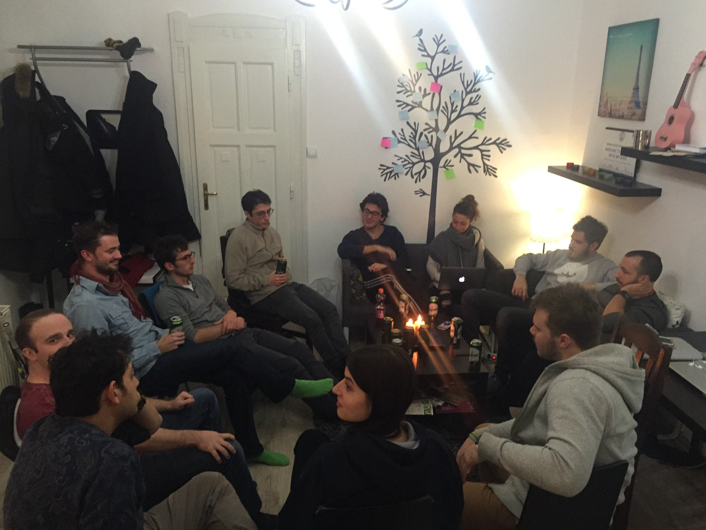
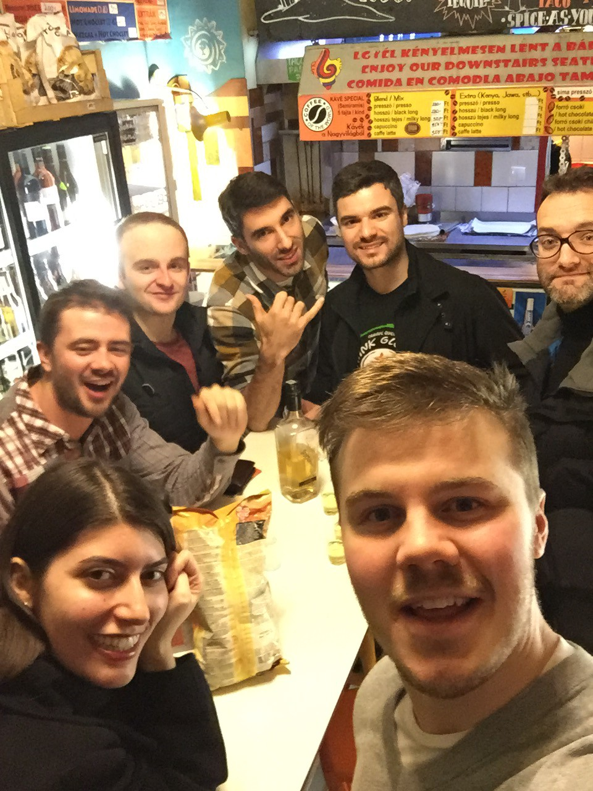
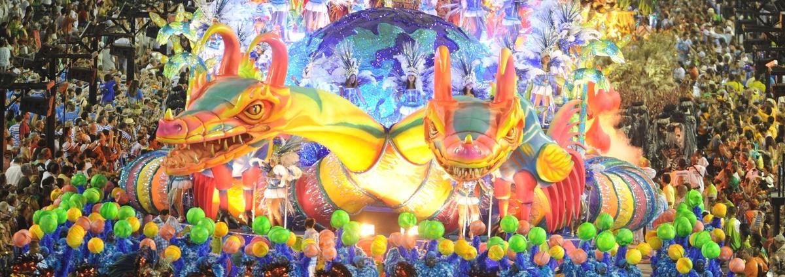

_One month ago I arrived to Hungary to participate in Startup House Budapest program. I didn’t know exactly what to expect from this “one month co-living and co-working experience”._

The two masterminds behind Startup House Budapest [Théau Ravier](https://medium.com/@theauravier) and [Thomas Despin](https://medium.com/@thomasdespin), shared with me and other participants the purpose of the project: **To create a working environment** in which a group of digital nomads can live together and work on their own projects or collaborate together on a new project. **It was about taking a group of like-minded people and forming them into a team of great friends.** A fridge always full of beer was also included. I was sold on that.

My expectations for Startup House Budapest were similar. I expected to meet cool people, have fun and have time to work on my projects as I had a lot of going on at the time.

It didn’t seem like a big thing in my life. I’ll just go there, hang out with the cool kids and, after a month, head on my own again. It’s exactly one month later and I’m speechless. The “cool kids” I met became my great friends and we’re already planning where to meet next.

**The amount of ideas created and projects worked on in the House is incredible.** I learned a new programming framework I’ve never used before. Tomorrow my company is launching our first application developed with it. That wouldn’t be possible without [Michiel Dral](https://medium.com/@Dral) who happened to be in the House and was rocking the framework.

The idea of Startup House goes far beyond than just house sharing. It’s the **full experience package**. You live, work and have fun with the others from the House and you get to meet the local culture of the city you’re in. [Théau Ravier](https://medium.com/@theauravier) and [Thomas Despin](https://medium.com/@thomasdespin) invited local startup owners to join us in the house for the talks and share of the ideas. It was really inspirational. I delivered couple of talks myself and hopefully inspired someone.

One evening, couple of guys from the house and I went to a cosy pub in Budapest. I was on my phone, searching for flights to Rio de Janeiro. I always wanted to go there and **going there during carnival felt like the perfect time**. I found a good flight through a flight deals app and filled in all my details. The only thing left was to swipe right to purchase the flight. I put my phone on the table and said to [Thomas Wilkinson](https://medium.com/@GenerationWilko): “Swipe right”. He looked at me confused, read the small text on the phone and said: “Is this for real?”… and: “I can’t swipe this for you.” :) So I took the phone and did the most dramatic and probably life-changing ‘swipe right’ of my life: I purchased the one month ticket to Rio. **Wow!**

[Thomas](https://medium.com/@GenerationWilko) immediately said he wants to join me. Heck, he went one step further and said: **“Let’s make Startup House Rio.”** I met Thomas one month earlier when we both joined Startup House Budapest. Now I felt like he’s a long known friend of mine. It didn’t take me a lot of thinking to say: **“Let’s do it!”** We started working on organizing [Startup House Rio](http://startuphouserio.com/) that same evening.

As the first participants are signing up and the event is taking shape, I can’t explain how excited I am to see it happening. **I want everyone to experience what I’ve experienced last month.** I’ll consider Startup House Rio a success if at least one new Startup House sets foundations there.

You can be a part of [**Startup House Rio**](http://startuphouserio.com/), too. It’s **from 28th January to 27th February 2016**. Join us and live your most productive month ever.

_We are all digital nomads, and we can be everywhere, but everywhere else can be lonely._

Apply here: [http://startuphouserio.com/](http://startuphouserio.com/)

