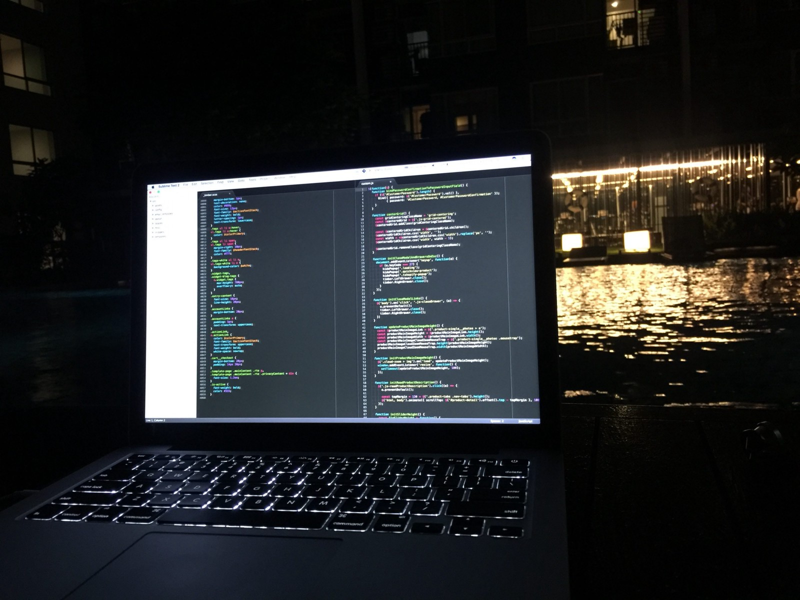
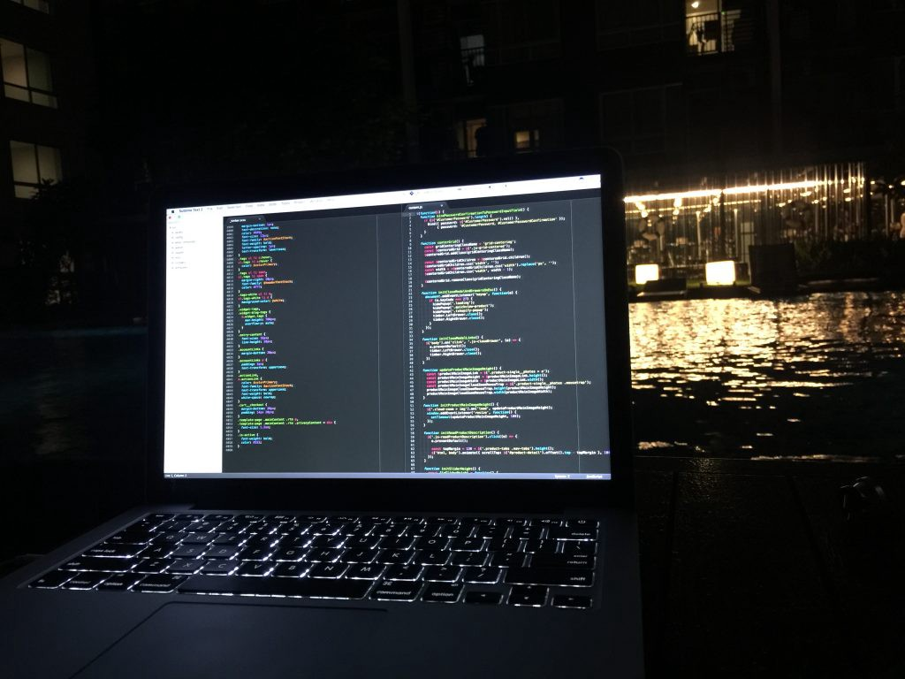

_Originally posted on:_ [_https://viktorfonic.com/learn-coding/_](https://viktorfonic.com/learn-coding/)

#### Why?

#### 1\. Software is Everywhere

We live in a digital world. Around 40% of the world population or around 3,000,000,000 (three billion) people has some sort of internet connection in their homes.\[1\] The number of smartphone users is forecast to grow from **1.5 billion** in 2014 to around **2.5 billion** in 2019.\[2\]

Just today, I used Google Maps to figure out which public transportation to take to reach my apartment in Bangkok.

The other day I used an app called Speak & Translate to write English on my phone and have it translated to Thai (written in Thai alphabet of course). With this I was able to speak with a fisherman on Koh Phi Phi island on Thailand. He was speaking back to my phone in Thai and I could read what he was saying almost instantly, in English. Incredible!

I listed my apartment on Airbnb for renting. It took me around half an hour to take some photos, upload them and write a nice description. We take this for granted, but can’t even imagine how difficult it was before to put apartment for short-term rent.

#### 2\. There’s so Much Demand

The demand for software developers has never been higher. More than 15 years ago we had desktop apps development. Since then, web development became the thing. 8 years ago we discovered smartphones. At that point, software developers needed were: desktop apps developers, web apps/sites developers, android developers and iOS developers. Couple of years ago, smart wearables became the thing. Meaning more developers. Today, your room carpet is connected to your toaster which is connected to your water bottle and it’s all in the cloud. Who makes apps for these? What about virtual reality that’s also just kicking in?

Unfortunately, the process of software development didn’t develop (pun intended) fast enough. Today it takes almost the same amount of time it took 15 years ago to build a desktop app! Hence, software development is here to stay for a good while.

Go to your local barber and tell him you build websites for living and he’ll ask you if you could make him one.

Remember that bar you visited last weekend? (I hope you do) It probably has a website.

The protein store? They wish they had their own eCommerce website to sell those products online.

A shopping center, a lawyer, a private clinic, restaurant, airport, bus operator, sport club, tourist agency, library, organization, rock band, you name it.

Unfortunately, there’s not enough people with skills who can build websites and mobile apps that all these people and businesses need. Yes, it’s getting easier every day to build a website with just some clicking and drag&dropping, but when you want a specific functionality, then your skills come to good use.

#### 3\. It’s Exciting

When I was 12 I wrote my first program. All it did was: ask your name, let you write it down and then greet you. I was so excited that I was able to make something, by myself, that anyone can use. I was giving the computer the exact instructions what it has to do. And it was following my orders.

> There’s only one technology that’s the hottest stone right now: JavaScript.

Imagine building the next self-driving car technology. Imagine building a medical app that saves millions of lives. Imagine increasing productivity of your company by writing that “impossible” excel function that saves everyone 20 minutes of shuffling around the excel data. Imagine writing that iPhone app you always wanted to have, but no one made it yet.

#### 4\. Software Development will Become Mainstream

I’m sorry for all of you hipsters out there: Software development is becoming mainstream. Some [school systems](http://theconversation.com/an-education-for-the-21st-century-means-teaching-coding-in-schools-42046) already started teaching coding to elementary and secondary schools. This is a great step forward. Imagine tomorrow when your new “Smart House 2056: Control your house” arrives. You will have to tell it what to do and when to do it.

For example: when I arrive home after work, play some chillout music. Think of how many variables are in that command. _When I_ (how will computer know it’s you and not your spouse?) _arrive home_ (how does the computer know you entered apartment instead of just passing by the neighborhood?) _after work_ (does it apply only if I arrive around 6pm or it also applies if I arrive after midnight?) _play some chillout music_ (do you have your own playlist or computer can find something for you online?).

There are already a lot of systems doing this. What I believe is the future is: a system that has a good set of predefined commands, and is also [easily customizable](https://ifttt.com/). You will always want to tweak it a little bit, trust me. (ever heard of DIY — Do It Yourself stores?)

#### What to Learn

There are so many programming languages, frameworks, technologies, etc. out there. Don’t despair. There’s only one technology that’s the hottest stone right now: JavaScript.

#### Learn HTML, CSS and JavaScript

Forget all the other programming languages and technologies. Today, what you need is: HTML, CSS and JavaScript. Everything else (Swift, Ruby, Ruby on Rails, Android, Java, Python, C++, SQL) might be useful later. But for now: HTML, CSS and JavaScript.

Knowing these three relatively inseparable technologies you can: build websites, mobile apps (both Android and iOS — with React Native), desktop apps (with Electron) and everything else, from databases to operating systems.

#### How to Learn

There’s nothing more satisfying than building your own application. Think of a problem you could solve for yourself with an app. Now go and build it.

That’s it. Start simple: build a calculator that can convert currencies, build an app that send you a notification every morning with a weather forecast, build your portfolio website…

> Google is the best online resource.

Once you’re done, come back here and read how to sell it:

[**Bootstrapping Side Projects into Profitable Startups**  
_I presented about bootstrapping startups to profit at Dutch startup school Growth Tribe. Here's the transcript. It's…_levels.io](https://levels.io/bootstrapping/ "https://levels.io/bootstrapping/")

#### Online Resources

Now, I’m sorry to let you down, but I’m not going to give you here a list of websites that will teach you coding ([in 21 days](http://abstrusegoose.com/249)?). I’ll tell you to use Google.

Google is the best online resource. There’s still no specific reputable search engine for coding (yet). Whatever you don’t know you can learn by “googling”. Want to learn HTML, but don’t know where to start? Try searching for “how to learn HTML”.

I’m doing software development for the last 10 years and I still use google every day. (!)

You can get any question answered by googling. It just takes time and practice.

And so many people have done it before you. If they can do it, so can you.

There’s so many self-taught software developers out there:

This girl didn’t know how to code so she decided to build 180 websites in 180 days. And she did it!

[**Jennifer Dewalt | 180 Websites**  
_Edit description_jenniferdewalt.com](https://jenniferdewalt.com/ "https://jenniferdewalt.com/")

This guy finished the whole MIT curriculum for computer science:

[**MIT Challenge**  
_Over the next 12 months, I'm going to learn the entire 4-year MIT curriculum for computer science, without taking any…_www.scotthyoung.com](https://www.scotthyoung.com/blog/myprojects/mit-challenge-2/ "https://www.scotthyoung.com/blog/myprojects/mit-challenge-2/")

Now [start](http://google.com/)!

Have fun!

#### References

\[1\] [http://www.internetlivestats.com/internet-users/](http://www.internetlivestats.com/internet-users/)

\[2\] [https://www.statista.com/statistics/330695/number-of-smartphone-users-worldwide/](https://www.statista.com/statistics/330695/number-of-smartphone-users-worldwide/)

